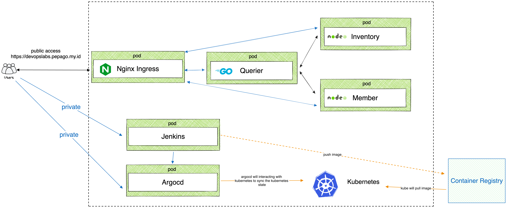
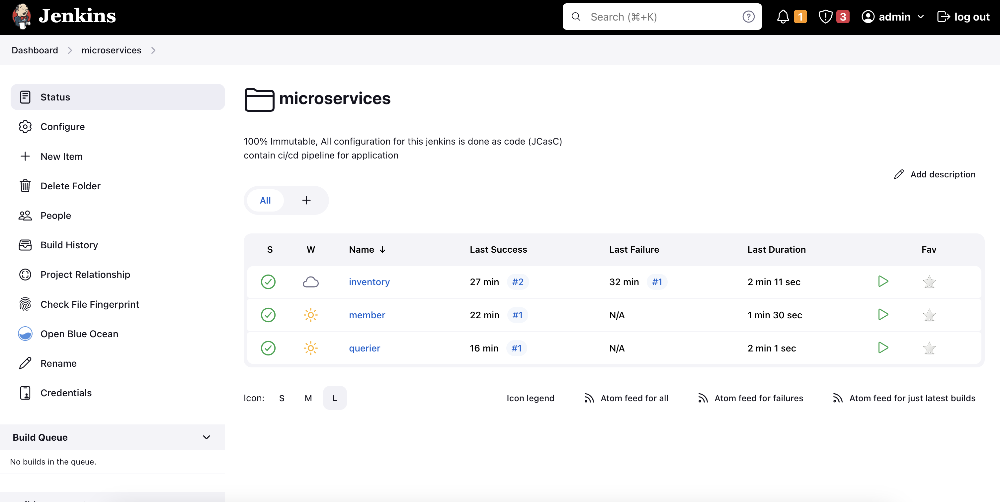
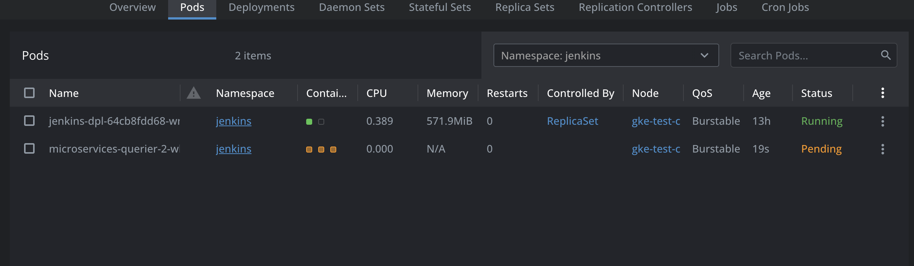
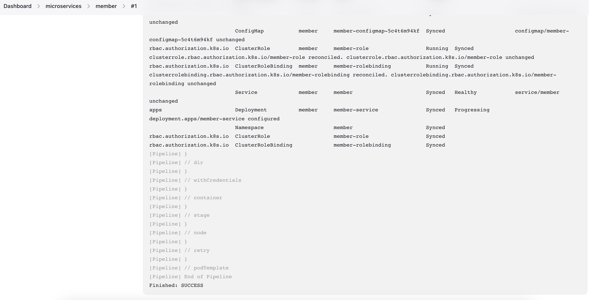
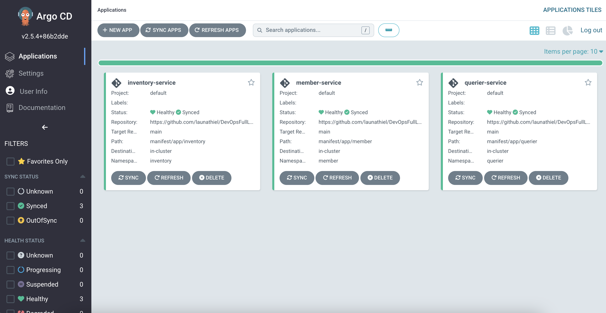
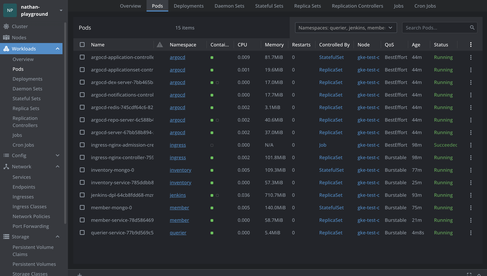

# DevOps Full Labs

## Tech Stack
- Kubernetes 
- Jenkins (CI/CD)
- ArgoCD (GitOps)
- Ingress Nginx
- Cert-Manager
- MongoDB 
- Member Service ( NodeJS )
- Inventory Service ( NodeJS )
- Querier Service ( Golang )

## CI/CD Pipeline
CI/CD pipeline running on top of jenkins that running on kubernetes. It will create a new pod as jenkins slave to execute job
1. Clone the source code from git repository
2. Build docker image with kaniko and push to registry ( https://hub.docker.com/u/launathiel )
3. Hit argocd using argoCD CLI to create new application
4. Set image parameter to argocd app
5. Sync argocd app
6. Observing the application

>public endpoint for querier service : https://devopslabs.pepago.my.id/

## Image
### Architecture


### Jenkins




### ArgoCD


### Lens


# Quick Start
```
# modify .env.test file as environment variable
docker network create labs-network
docker-compose up -d --build
```

## ToDo
- Implement redis as cache
- Create 1 service that connect to postgresql
- Create tracing using opentelemetry
- Setup OTEL collector
- Setup jager with elasticsearch

keep exploring and learning, cheers!